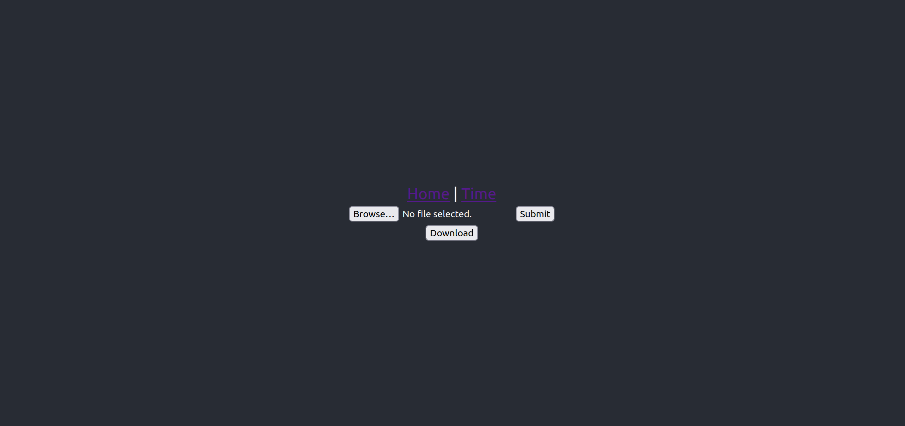

# Fullstack template for Web-apps that upload and download files

## Description
This is a Flask and React webapp with which users can upload images to a server and then download them again.
There are also options for containerizing the app(s) with Docker.

## Screenshot

## Setup
### Simple setup
Download the code:
    git clone git@github.com:bauerem/flask-upload-download.git

Start the API:
        cd flask-upload-download/api
        python3 -m venv venv
        . venv/bin/activate
        pip install -r requirements.txt
        flask run

Start the client:
        cd flask-upload-download
        npm i
        npm run start