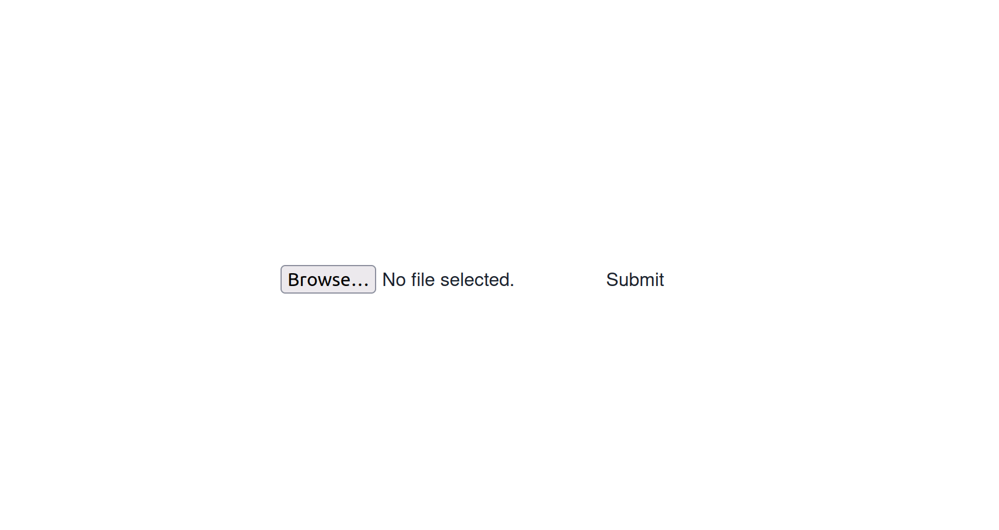

# Fullstack template for Web-apps that upload and download files

## Description
This is a Flask and React webapp with which users can upload images to a server,
have them processed by a user defined service and then download the processed
file again.

Note that the file processing is done in parallel in a new process.

There are also options for containerizing the app(s) with Docker.

## Screenshot

## Setup
### Simple setup
Download the code:

    git clone git@github.com:bauerem/uploader-downloader-template.git

Start the API:

    cd flask-upload-download/api
    mkdir static/files
    python3 -m venv venv
    . venv/bin/activate
    pip install -r requirements.txt
    flask run

Start the client:

    cd flask-upload-download
    npm i
    npm run start

### Defining a Service
After the file gets uploaded, it is being passed to a service and processed.
You can define that file procession in `./api/service.py`. You have to do the
following steps:

- Define the allowed mime-types of the uploaded file by decalring 
  `self.allowed_mime_types`.
- Since the processing might change the file type, you also have to define the
  output extension. In the given example, the oprocessed file has the same
  type as the input file.
- Lastly, you implement your processing of the file in the function `process()`.
  Note: `process()` is being passed to a new process.
  